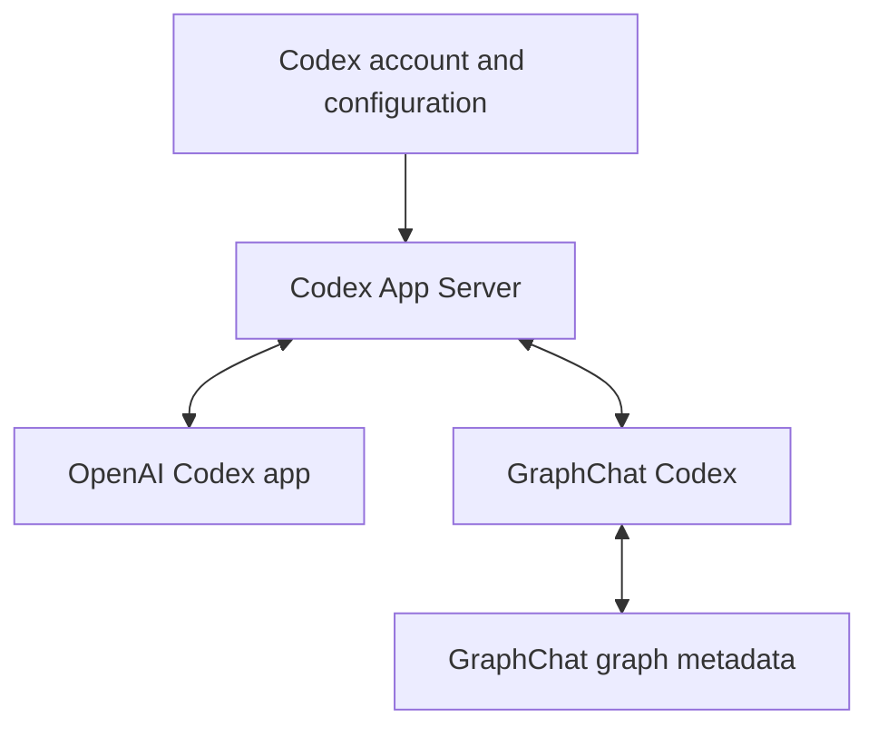

Yes. My understanding is:

> **GraphChat Codex should be an alternative, graph-oriented client for the Codex runtime, using the supported Codex App Server protocol and remaining interoperable with OpenAI’s Codex app.**

It is not a replacement implementation of Codex, an API wrapper, or a way to reproduce the Codex harness ourselves. OpenAI explicitly describes App Server as the interface for building rich clients with Codex authentication, conversation history, approvals, and streamed agent events. ([developers.openai.com](https://developers.openai.com/codex/app-server/))

**The Product Model**



Both applications are clients of the same underlying Codex system:

- **OpenAI Codex app:** linear, project-oriented Codex interface.
- **GraphChat Codex:** spatial, branching, graph-oriented Codex interface.
- **App Server/Codex runtime:** executes turns, manages threads, calls tools, applies sandbox rules, handles models and streams events.
- **GraphChat metadata:** describes how multiple Codex threads form one visual conversation graph.

**What Codex Should Own**

Codex should remain authoritative for:

- Authentication and ChatGPT subscription usage
- Models and reasoning effort
- Threads, turns and items
- Conversation context supplied to the model
- Compaction and context management
- Tool execution
- Skills, MCP servers and plugins
- `AGENTS.md` and Codex configuration
- Sandbox and approval policy
- Command/file-change approval requests
- Agent events and tool results

GraphChat should communicate through App Server methods such as:

- `thread/start`
- `thread/resume`
- `thread/fork`
- `thread/read`
- `thread/list`
- `thread/rollback`
- `turn/start`
- `turn/interrupt`

We should avoid reading or modifying Codex’s internal databases directly.

**What GraphChat Should Own**

GraphChat owns the representation Codex does not provide:

- Canvas positions and node dimensions
- Edges between graph nodes
- Which Codex threads belong to one GraphChat graph
- Branch labels, colors and annotations
- Selected branch and viewport state
- Attachments or notes that are GraphChat-specific
- Portable transcript mirrors
- GraphChat sync metadata

A completed assistant node should effectively contain:

```ts
{
  content: "Portable rendered response",
  codexRef: {
    threadId,
    turnId,
    cwd,
    model,
    effort
  },
  graphMetadata: {
    parentNodeId,
    position,
    size
  }
}
```

The text mirror lets GraphChat render offline or on another device. The `codexRef` lets a desktop installation reconnect to the real Codex history.

**How Branching Maps**

A GraphChat tree is an overlay across multiple linear Codex threads:

```text
GraphChat:

A -> B -> C
     \
      D -> E
```

```text
Codex:

Thread 1: A, B, C
Thread 2: A, B, D, E
```

OpenAI’s Codex app would normally display these as two independent linear threads. GraphChat knows they are related because its graph metadata associates both with the same graph.

This means we are not trying to make Codex store an arbitrary graph. We are presenting related native Codex threads as a graph.

**What Interoperability Should Mean**

I think we should define it at four levels.

1. **Runtime interoperability**

   Both apps use the real Codex runtime, authentication, models, tools and configuration.

2. **Thread interoperability**

   A thread created in GraphChat can be opened and continued in the OpenAI Codex app. A thread created or continued in the Codex app can be imported or refreshed in GraphChat.

3. **Workspace interoperability**

   Threads are associated with the same `cwd`, projects and worktrees. Codex configuration, skills and MCP settings behave consistently. The Codex app already treats projects roughly as sessions scoped to particular directories. ([developers.openai.com](https://developers.openai.com/codex/app/features/))

4. **Graceful degradation**

   If GraphChat metadata disappears, the Codex threads remain usable in the official app. If a Codex thread is unavailable, GraphChat still shows its mirrored transcript and graph.

That last property is important. Neither system should corrupt or invalidate the other.

**Canonical Data**

I would refine our earlier “GraphChat is the source of truth” language:

- **Codex is canonical for agent conversation history and execution.**
- **GraphChat is canonical for graph structure and presentation.**
- **GraphChat stores a portable mirror of Codex content, but should reconcile it against App Server when available.**

That is more compatible with the alternate-client goal than treating GraphChat’s transcript as completely independent.

**Authentication**

GraphChat should never extract or directly manage ChatGPT access tokens.

Instead:

1. GraphChat launches or connects to Codex App Server.
2. Codex uses its normal cached login.
3. If login is required, Codex initiates its supported login flow.
4. Codex refreshes and stores its own credentials.
5. GraphChat receives only account status and runtime events.

Codex officially supports ChatGPT sign-in for subscription access and caches that authentication for reuse. ([developers.openai.com](https://developers.openai.com/codex/auth/))

**Important Things Still to Flesh Out**

1. **Bidirectional synchronization**

   What happens when someone continues the same thread in the OpenAI app while GraphChat has it open? We need refresh, conflict detection and active-turn handling.

2. **Official-app-created forks**

   We need to verify whether App Server exposes enough ancestry metadata to automatically group forks created outside GraphChat.

3. **Project indexing**

   Threads are Codex-owned, but project sidebar ordering, pins and recent-project presentation may partly belong to the official app. We should interoperate by `cwd` rather than attempting to reproduce its private sidebar database.

4. **Process topology**

   We currently launch our own App Server process using the same Codex installation and account. We should test concurrency with the official app and determine whether connecting through a shared local transport provides any concrete benefit.

5. **Protocol versioning**

   App Server evolves with the installed Codex version. We should generate or bundle version-matched schemas, detect capabilities, and isolate protocol differences behind the runtime adapter.

6. **Google Drive and mobile**

   We should sync GraphChat’s graph metadata and transcript mirrors, not Codex credentials or private runtime storage. On mobile, Codex threads would initially be viewable but not executable unless the phone securely connects to a desktop-hosted App Server bridge.

7. **Feature parity boundary**

   We need to decide which official Codex app features GraphChat must expose: worktrees, Git review, terminal, automations, browser use, computer use, skills, plugins and MCP. My preference is to expose App Server capabilities incrementally rather than cloning the entire official interface.

So yes, we are aligned. The next architectural milestone should strengthen **bidirectional thread interoperability**, not merely add more chat UI: list/read native Codex threads, group them by workspace, import them into graphs, and reconcile external changes without taking ownership away from Codex.